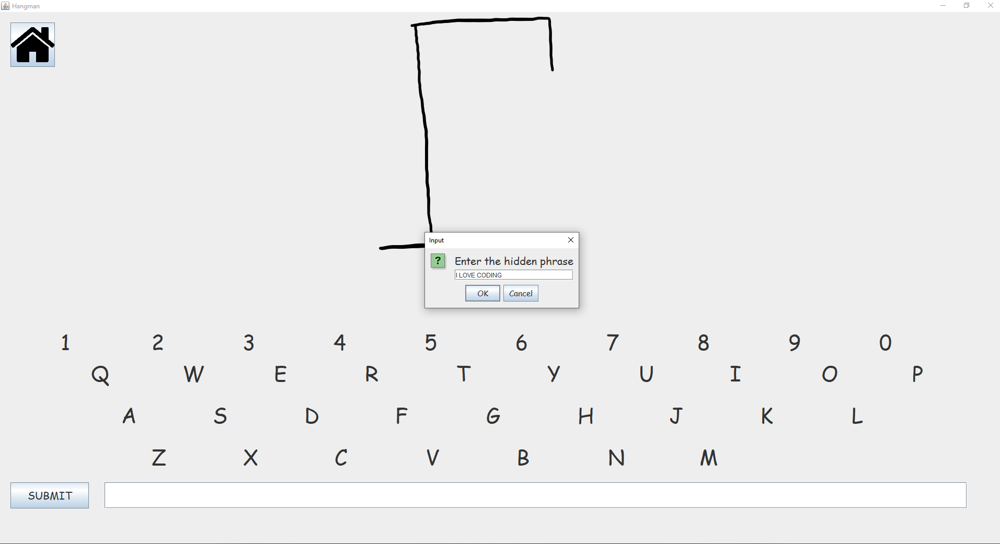

<h1>Hangman in Java</h1>
<h2>If You Download</h2>
Add res folder and main to source path 
 
 

In this program, you can have 8 saved player slots that hold the name of what the user desires. If the user choosing to make a new character, the program with prompt them to offer a new name. 

When a player has been selected, the user is given the choice to play the game, rename the player, or delete the save slot.

When the user enters a game, they will be prompted to enter the hidden phrase. Once they do, the game will act like any hangman game will. Enter one letter and it will reveal any letter that is in the hidden phrase 

Answer wrong and the hangman will slowly appear. 

Whether the user loses or not, it will reveal the hidden message and prompt the user to play again, go home, or select a new player. Play again and you might encounter a new hanged man 
<h2>Things to improve on</h2>
During this project, I somewhat rushed since I wasn't as focused on making it the best it can be. but rather expirence I can use later. 
But there are mulitple things in this progam that I can change if given the right time including: 
<ul>
  <li>Removing repeated code and making more methods to reduce the lines of code</li>
  <li>Implementing changing colors for whether you get the letters wrong or not</li>
  <li>Add new hangamn characters</li>
  <li>Adding a win and loss counter</li>
</ul>
<h2>Learned</h2>
<ul>
  <li>Using JOptionPane</li>
  <li>Manipulating a textfile and reading it and implementing it into the program to make sudo-save files</li>
  <li>Using the CardLayout class to implement multiple panels </li>
</ul>
<h2>Known Issues</h2>
Inputing more than one character when answering the hidden phrase 
<li>Its a really easy fix to only accpet one character in the text field, but I originally thought and tested  that it works even if its more than one character.
  However, I believe that the main cause is when the code tries to find if the last character is included or not</li>
Window Scaling 
<li>Like the previous project, I can't seem to find the solution to this JFrame window scaling despite trying numerous things</li>
